

[![Contributors][contributors-shield]][contributors-url]
[![Forks][forks-shield]][forks-url]
[![Stargazers][stars-shield]][stars-url]
[![Issues][issues-shield]][issues-url]
[![GPLv2 License][license-shield]][license-url]

<!-- PROJECT LOGO -->
 

  <h3 align="center">EBNF Visualizer</h3>

  

    <a href="https://github.com/MordragT/ebnf-visualizer/issues">Report Bug</a>
    ·
    <a href="https://github.com/MordragT/enbf-visualizer/issues">Request Feature</a>
  

<!-- TABLE OF CONTENTS -->

  
Table of Contents

  <ol>
	<li><a href="#introduction">Introduction</a></li>
	<li><a href="#simple-example">Simple example</a></li>
	<li><a href="#ebnf">EBNF - Extended Backus Naur Form</a></li>
	<li><a href="#writing-ebnf">Writing an .ebnf-file</a></li>
	<li><a href="#menu">Menu</a></li>
	<li><a href="#functions">Functions</a></li>
	<li><a href="#license">License & Copyright</a></li>
	</ol>

## Introduction

This program visualizes EBNF (Extended Backus Naur Form). Therefore an .ebnf  File is required, which contains rules written in EBNF. The program parses the rules, visualizes them in form of syntax diagrams and is able to generate .gif files for further use. Furthermore the program allows to manipulate the look of the generated syntax diagrams.

(<a href="#readme-top">back to top</a>)

## Simple Example

### Step 1

Create a .ebnf file with a rule just like �A= a [b] c.�. A .ebnf file is just a simple .txt file, just change the ending of the file.

### Step 2

Start the program and open the .ebnf file via the menu entry �Load Grammar��. The program parses it. If there exist errors in the .ebnf file, it would be reported in the log window. Otherwise the rule menu will be activated.

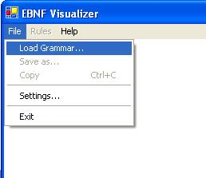

### Step 3

Choose a rule from the loaded grammar in the rule menu. The chosen rule will be drawn.

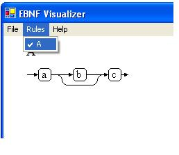

### Step 4 (optional)

Change the look of the syntax diagram in the menu File/Settings.

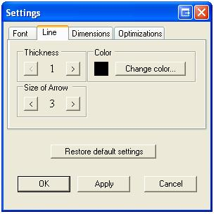

### Step 5 (optional)

Save the syntax diagram or just copy/paste it.

(<a href="#readme-top">back to top</a>)

## EBNF

EBNF is used to define the grammar of programming languages.

Therefore a set of rules is specified. These are known as production rules.
They define the patterns or sequences of symbols allowed in the language. Each production rule defines the pattern that represents a named structured part of the language, such as an expression or a statement.
The name of such a part is called a non-terminal symbol in the language. The basic building blocks of the language are symbols which stand for themselves.
These can be individual characters or combinations such as keywords and arithmetic operators. These basic elements of the language are called terminal symbols.

(<a href="#readme-top">back to top</a>)

## Writing EBNF

The following description is informal but will allow you to write EBNF that works with this program.

A grammar consists of a set of rules. A rule consist of an identifier, followed by “=”, a sequence of meta, terminal and nonterminal symbols and ends with “.” (e.g. “A= a b [c].”) 

 
### Terminal symbol

A terminal symbol can be any string. They are separated by space characters.
For example in the rule “A = a b [c].” a, b and c are terminal symbols.

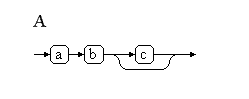

It is also possible to put a terminal symbol under quotes (“) or apostrophes (‘) which is required in some cases. (eg. Quote = "'" a "'".)

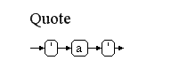

It’s also needed for numbers, because identifiers must begin with a character. 

### Nonterminal symbol

A nonterminal symbol can’t be created in an explicit way.
If a terminal symbol matches the string of an rule identifier, it is automatically considered as a nonterminal symbol.
For example, in the rule “A = a A | b.” A is a nonterminal symbol. 

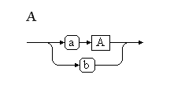

### Meta symbols

#### option “[“ “]”

The sequence of symbols within these brackets are optional.
(e.g. Rule1 = “begin [optional things] end.”) 

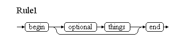

#### iteration “{“ “}”

The sequence of symbols within these brackets can occur from zero to infinite times.
(e.g. Rule2 = “begin {and again} end.”) 

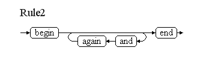

#### alternative “|”

It allows to choose a sequence of symbols.
(e.g. Rule3 = “I am a (good | bad) programmer.”) 

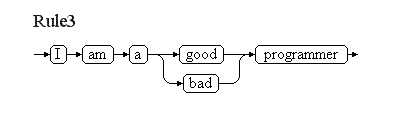

#### grouping “(“ “)”

These brackets are used to group sequences of symbols in a mathematical way.

### Special symbol – Line break

This program allows to make explicit line breaks within a syntax diagram. To do this, use “\n” in the outer structure of the rule. That means, it will be ignored within an option, iteration or alternative.
(e.g. “Linebreak = First line \n Second line \n End.”) 

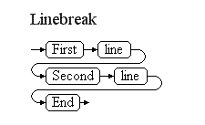

(<a href="#readme-top">back to top</a>)

## Menu

### File

#### Load Grammar

Allows to load a grammar file (*.ebnf). 

#### Save As

The current rule can be stored as .GIF file or as .EMF file.
The Windows Enhanced Metafile Format .EMF is based on vectorgraphics and
therefore better suitable for printing or zooming.

#### Copy

The current rule is copied to the clipboard as a picture. It is possible to paste it into any program which allows to paste from the clipboard.
	
#### Settings

In the menu settings the look of the syntax diagrams can be changed.

**Font**

Change the font of terminal and nonterminal symbols.

**Line**

Change the thickness and the color of the line. It is also possible to increase or decrease the size of the arrows.

**Dimensions**

It is possible to increase or decrease the horizontal and vertical gap between the symbols.
The look of the terminal and nonterminal symbols can be changed by increasing or decreasing the gap between the line of the symbol and its name.

**Optimizations**

If the checkbox "Enable optimizations" is activated, the syntaxgraph will be optimized. Any change of this option requires to reload the actual grammar.

(<a href="#readme-top">back to top</a>)

## Functions

### Optimizations

This happens implicitly. It is possible to disable them in the settings menu.
If the syntax graph is optimized, redundant und needless productions within a rule are deleted. That means empty nodes, iterations, options and alternatives are removed. If there is an empty alternative, it is moved to the first position. Already existing alternatives are removed. Furthermore some productions are visualized in a more elegant way,
for example “A = ab {ab}.” 

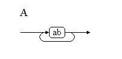

or “B = ab { cd ab}.” 

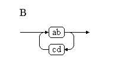

### Navigation

It is possible to navigate through an grammar by left-clicking on nonterminal symbols. Right-clicking allows to go back.

(<a href="#readme-top">back to top</a>)

## License

EBNF Visualizer

Copyright (c) 2005 Stefan Schoergenhumer, Markus Dopler
supported by Hanspeter Moessenboeck, University of Linz,
2022 Thomas Wehmöller

This program is free software; you can redistribute it and/or modify it 
under the terms of the GNU General Public License as published by the 
Free Software Foundation; either version 2, or (at your option) any 
later version.

This program is distributed in the hope that it will be useful, but 
WITHOUT ANY WARRANTY; without even the implied warranty of MERCHANTABILITY or FITNESS FOR A PARTICULAR PURPOSE.  See the GNU General Public License for more details.

You should have received a copy of the GNU General Public License along 
with this program; if not, write to the Free Software Foundation, Inc., 
59 Temple Place - Suite 330, Boston, MA 02111-1307, USA.

(<a href="#readme-top">back to top</a>)

<!-- MARKDOWN LINKS & IMAGES -->
<!-- https://www.markdownguide.org/basic-syntax/#reference-style-links -->
[contributors-shield]: https://img.shields.io/github/contributors/MordragT/ebnf-visualizer.svg?style=for-the-badge
[contributors-url]: https://github.com/MordragT/ebnf-visualizer/graphs/contributors

[forks-shield]: https://img.shields.io/github/forks/MordragT/ebnf-visualizer.svg?style=for-the-badge
[forks-url]: https://github.com/MordragT/ebnf-visualizer/network/members

[stars-shield]: https://img.shields.io/github/stars/MordragT/ebnf-visualizer.svg?style=for-the-badge
[stars-url]: https://github.com/MordragT/ebnf-visualizer/stargazers

[issues-shield]: https://img.shields.io/github/issues/MordragT/ebnf-visualizer.svg?style=for-the-badge
[issues-url]: https://github.com/MordragT/ebnf-visualizer/issues
[license-shield]: https://img.shields.io/github/license/MordragT/ebnf-visualizer.svg?style=for-the-badge
[license-url]: https://github.com/MordragT/ebnf-visualizer/blob/master/LICENSE.txt